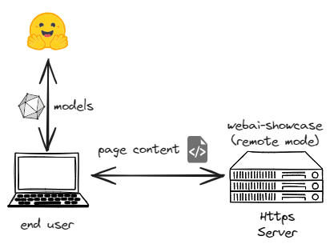
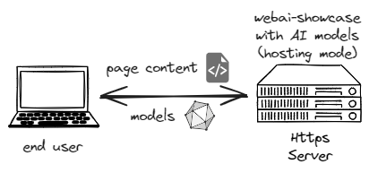

# Web-AI-showcase

This project is a website which demonstrates some emerging Web AI demos that run locally in your browser, powered by WebAssembly, WebGPU and WebNN technologies.

## Requirements

- node 16+
- npm

## Environment Setup

Install necessary dependencies

```shell
npm install
```

## Model downloading

This website itself is a static page without dependency to any server APIs. However the models needed by every AI tasks must be downloaded from somewhere to the users' browser.

To better adapt to various deployment environments, we provide two modes for model downloading:

1. **Remote mode** (Download models from huggingface)

   In this mode, the end users'(who use the browser to access this web page) browsers will fetch model files from huggingface.

   

   > This mode is useful when the end users can access huggingface easily or the hosting server can't store large files.

2. **Hosting mode** (Download models from hosting server)

   In this mode, we can download the required models to the hosting server in advance, and the end users' browsers will fetch model files from the server hosting this web page.

   

   > This mode is useful when the end users don't have access to huggingface or their network is too slow to download large files from huggingface.

   > In **Hosting mode** only models are deployed on the hosting server, the end users' browser still need to fetch some other resources (e.g. some wasm files) through CDN, this means **Hosting mode** is not suitable for pure offline environment.

_Note_: **`LLM-Gemma`** uses the **`gemma-2b-it-gpu-int4`** model, which must be downloaded and loaded manually before inference. See [this](https://www.kaggle.com/models/google/gemma/tfLite/) for more details.

## Build the showcase

The build phase will bundle the source code.

If using **Hosting mode**, it will also download required models and put into correct directories.

### Build with **Remote mode**

```shell
  npm run prod:use-remote-models
```

### Build with **Hosting mode**

```shell
  npm run prod
```

> This may take a long time to download model files (~3GB to download).

## Launch the showcase

### Setup https server

##### SSL Preparation

`HTTPS` is required since we use WebGPU in some samples and WebGPU is only available in [secure-context](https://developer.mozilla.org/en-US/docs/Web/Security/Secure_Contexts).

We provide a npm script to generate ssl based on `openssl`. Try to install `openssl` if you don't have it on your system.

- Linux

  ```shell
  # install openssl
  sudo apt-get install libssl-dev
  # generate `cert.pem` and `key.pem`
  npm run generate-ssl
  ```

- Windows: `openssl` is bundled with `Git` so that you can directly generate `cert.pem` and `key.pem` with following command in `gitbash` if you have `Git` installed.

  ```shell
  openssl req -newkey rsa:2048 -new -nodes -x509 -days 3650 -keyout key.pem -out cert.pem
  ```

  Then move the `cert.pem` and `key.pem` into the project root directory.

> _You can also setup https server with other solutions(like `Express` and `Caddy`) and set the `./dist` as root directory._

##### Launch the server

```shell
  npm run startup
```

Once finished, open the browser and navigate to:
https://localhost:8080
or
https://_your-server-ip_:8080

## LICENSE

Some samples for this repository are based on modifications of examples from [Transformers.js](https://github.com/xenova/transformers.js)(Apache-2.0) and [MediaPipe](https://github.com/google-ai-edge/mediapipe)(Apache-2.0).

| Sample                                                                  | Source                                                                                                       | Model                                                                                   | Model License                                                                                                |
| ----------------------------------------------------------------------- | ------------------------------------------------------------------------------------------------------------ | --------------------------------------------------------------------------------------- | ------------------------------------------------------------------------------------------------------------ |
| [Background Removal](./samples/image_background_removal/)               | [Transformers.js](https://github.com/xenova/transformers.js/tree/main/examples/remove-background-client)     | [RMBG-1.4](https://huggingface.co/briaai/RMBG-1.4)                                      | [bria-rmbg-1.4](https://bria.ai/bria-huggingface-model-license-agreement/)                                   |
| [Image to text](./samples/image_to_text/)                               | [Transformers.js](https://github.com/xenova/transformers.js/tree/main/examples/demo-site)                    | [ViT-GPT2](https://huggingface.co/nlpconnect/vit-gpt2-image-captioning)                 | Apache-2.0                                                                                                   |
| [Question Answering](./samples/question_answering/)                     | [Transformers.js](https://github.com/xenova/transformers.js/tree/main/examples/demo-site)                    | [DistilBERT](https://huggingface.co/distilbert/distilbert-base-cased-distilled-squad)   | Apache-2.0                                                                                                   |
| [Summarization](./samples/summarization/)                               | [Transformers.js](https://github.com/xenova/transformers.js/tree/main/examples/demo-site)                    | [DistilBART CNN](https://huggingface.co/sshleifer/distilbart-cnn-6-6)                   | Apache-2.0                                                                                                   |
| [Phi3 WebGPU](./samples/phi3-webgpu/)                                   | [Transformers.js](https://github.com/xenova/transformers.js/tree/v3/examples/webgpu-chat)                    | [Phi-3-mini-4k](https://huggingface.co/microsoft/Phi-3-mini-4k-instruct-onnx)           | [MIT](https://huggingface.co/microsoft/Phi-3-mini-4k-instruct-onnx/blob/main/LICENSE)                        |
| [LLM Gemma](./samples/llm_gemma/)                                       | [MediaPipe](https://github.com/google-ai-edge/mediapipe)                                                     | [Gemma-2B](https://www.kaggle.com/models/google/gemma/tfLite/)                          | [Gemma](https://ai.google.dev/gemma/terms)                                                                   |
| [SD Turbo](./samples/stable_diffusion/)                                 | [guschmue/ort-webgpu](https://github.com/guschmue/ort-webgpu/tree/master/sd-turbo)                           | [SD Turbo](https://huggingface.co/schmuell/sd-turbo-ort-web/)                           | [STABILITY AI COMMUNITY LICENSE AGREEMENT](https://huggingface.co/stabilityai/sd-turbo/blob/main/LICENSE.md) |
| [DeepSeek R1 WebGPU (local model)](./samples/deepseek-r1-webgpu-local/) | [Transformers.js](https://github.com/huggingface/transformers.js-samples/tree/main/deepseek-r1-webgpu-local) | [DeepSeek-R1](https://huggingface.co/onnx-community/DeepSeek-R1-Distill-Qwen-1.5B-ONNX) | [MIT](https://huggingface.co/deepseek-ai/DeepSeek-R1-Distill-Qwen-1.5B/blob/main/LICENSE)                    |
| [DeepSeek R1 WebGPU (remote model)](./samples/deepseek-r1-webgpu/)      | [Transformers.js](https://github.com/huggingface/transformers.js-samples/tree/main/deepseek-r1-webgpu)       | [DeepSeek-R1](https://huggingface.co/onnx-community/DeepSeek-R1-Distill-Qwen-1.5B-ONNX) | [MIT](https://huggingface.co/deepseek-ai/DeepSeek-R1-Distill-Qwen-1.5B/blob/main/LICENSE)                    |
